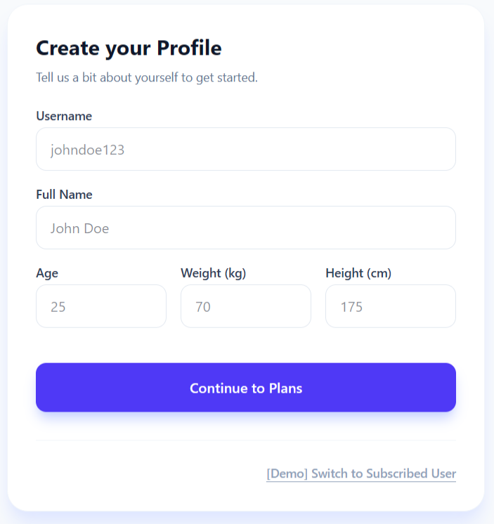
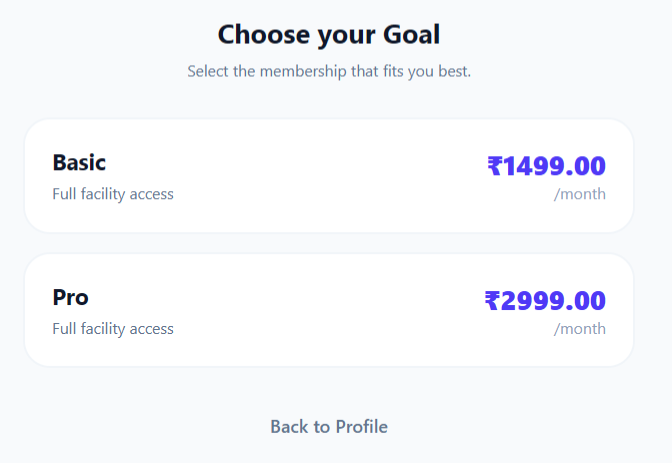
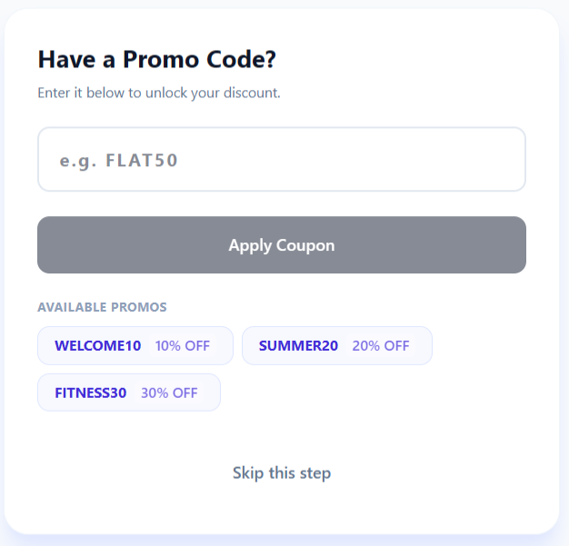
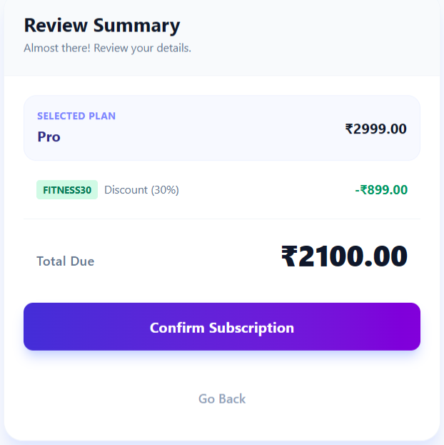
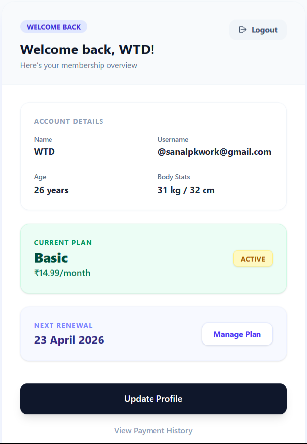

# EazyGym Subscription System

A full-stack modern React and Express application built on the Bun runtime handling secure integer-based subscription logic, promotional code validation throttling, and profile data persistence.

## 📸 Application Flow
Here is a complete walkthrough of the subscription process exactly as designed:

| 1. Profile Creation | 2. Premium Plans | 3. Promo Codes |
| :---: | :---: | :---: |
|  |  |  |

| 4. Subscription Summary | 5. Live User Dashboard |
| :---: | :---: |
|  |  |

## Tech Stack
* **Frontend**: React (Vite), Tailwind CSS, React Router DOM, Axios
* **Backend**: Node.js (Bun Runtime), Express.js, Zod Validations
* **Database**: Native SQLite (`bun:sqlite`), strictly using transactional atomic writes.

## Features
- **Concurrent DB Transactions**: Highly-safe relational DB queries wrap atomic bounds mitigating any race conditions (e.g. limiting coupon `max_uses`).
- **Strict Integer Arithmetic**: Prices strictly calculate in primitive fractions securely eliminating floating-point memory conversion leaks.
- **RESTful Endpoints**: Full parameterized schemas blocking SQL Injection utilizing `db.prepare(?)`.
- **Client Persistence**: React maps `localStorage` seamlessly locking navigation contexts and automatically rendering safe numerical conversions via `.toFixed(2)` views.

## 🚀 Quick Start Instructions

This project requires [Bun](https://bun.sh/) to be installed on your machine.

### 1. Database & Backend Server Setup
From the master repository route, enter the `server` directory, install packages, and boot the backend on Native Port 3001.

```bash
cd server
bun install
bun run dev
```

*Note: You do not need to manually configure the initial SQL Data; the `server/src/db/index.ts` automatically scaffolds the database `subscription_sys.sqlite` alongside valid `Plans` and `Coupons` tables (e.g., WELCOME10, FITNESS30).*

### 2. React Client Initialization
Open a second terminal window, shift into the `client` directory, load the dependencies, and bind the Vite application to Port 3000.

```bash
cd client
bun install
bun run dev
```

### 3. Using the App
- Open your browser to `http://localhost:3000`.
- Complete the onboarding profile sequence via the beautifully designed Tailwind Dashboard.
- Provide a standard demo coupon like `SUMMER20` during checkout to witness the immediate 20% discount applied to your final summary screen natively!
